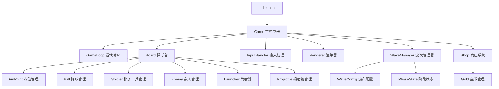
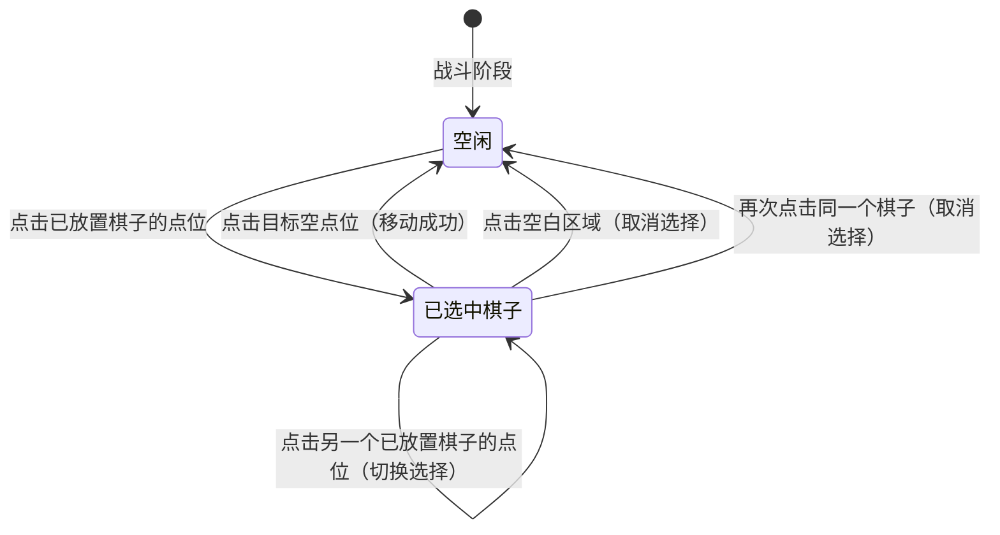
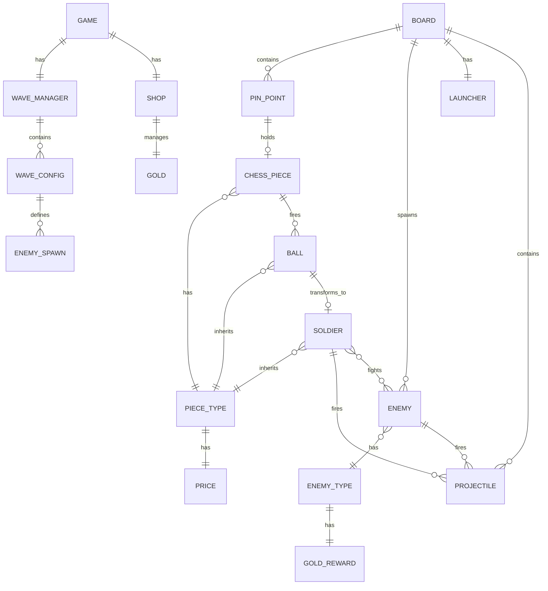

# 设计文档：策略弹球棋子游戏

## 概述

本游戏是一个基于 HTML5 Canvas 的策略弹球游戏 Demo，采用纯 HTML + Canvas + JavaScript 实现，单文件即可运行。游戏分为上下两个区域：上方是弹球区域（包含点位、棋子、弹球），下方是地面战斗区域（棋子士兵与敌人对抗）。

核心玩法：玩家在弹球台的点位上放置不同类型的棋子，棋子自动发射弹球；弹球在碰撞钉之间反弹，最终落地转化为棋子士兵；棋子士兵向右移动迎击从右侧涌来的敌人。

游戏以波次制推进，每波分为两个阶段：购买摆放阶段（玩家在商店中用金币购买棋子并放置到点位上）和战斗阶段（棋子自动发射弹球，弹球落地转化为士兵与敌人战斗）。击败敌人获得金币，击败当前波次所有敌人后进入下一波。

技术选型：纯 HTML5 + Canvas + JavaScript，无外部依赖，单个 `.html` 文件即可在浏览器中运行。

## 架构

### 整体架构

采用经典的游戏循环架构，单文件内通过模块化的类/对象组织代码：


    
    C --> L[update 更新逻辑]
    C --> M[render 渲染逻辑]
    
    L --> N[Physics 物理系统]
    L --> O[Combat 战斗系统]
```

### 游戏循环

使用 `requestAnimationFrame` 驱动游戏循环，每帧执行：

1. 计算 deltaTime（帧间隔时间）
2. 更新（Update）：
   - 购买摆放阶段：仅处理商店交互和棋子放置，不执行物理和战斗逻辑
   - 战斗阶段：物理运动、碰撞检测、棋子发射、战斗判定、生命周期管理、波次完成检测
3. 渲染（Render）：清空画布、绘制弹球台、点位、棋子、弹球、棋子士兵、敌人、UI、商店面板、波次信息

### 坐标系统

- 原点在 Canvas 左上角
- X 轴向右为正
- Y 轴向下为正（与 Canvas 默认一致）
- 重力方向：Y 轴正方向（向下）

## 组件与接口

### 1. Game（游戏主控制器）

负责初始化所有子系统，管理游戏状态（运行/暂停），协调各组件。

```javascript
class Game {
    constructor(canvas)
    init()           // 初始化游戏
    start()          // 开始游戏循环
    pause()          // 暂停
    resume()         // 继续
    reset()          // 重置
    update(dt)       // 每帧更新
    render()         // 每帧渲染
}
```

### 2. PinPoint（点位）

表示弹球台上的一个碰撞节点，可以是空的碰撞钉或已放置棋子。

```javascript
class PinPoint {
    constructor(x, y)
    x, y             // 位置坐标
    radius           // 碰撞半径
    chessPiece       // 放置的棋子（null 表示空点位/碰撞钉）
    isEmpty()        // 是否为空（碰撞钉状态）
    placePiece(type) // 放置棋子
    removePiece()    // 移除棋子
}
```

### 3. ChessPiece（棋子）

放置在点位上的策略单元，定期发射弹球。

```javascript
class ChessPiece {
    constructor(type, pinPoint)
    type             // 棋子类型（PieceType）
    pinPoint         // 所在点位
    lastFireTime     // 上次发射时间
    canFire(now)     // 是否可以发射
    fire()           // 发射弹球，返回 Ball 实例
}
```

### 4. PieceType（棋子类型配置）

定义棋子类型的静态配置数据。

```javascript
const PIECE_TYPES = {
    FIRE: {
        name: '火战士',
        color: '#FF4444',
        fireInterval: 2000,   // 发射间隔（毫秒）
        ballSpeed: 3,         // 弹球初始速度
        combatType: 'melee',  // 战斗类型：近战
        soldierHP: 5,         // 转化士兵的生命值
        soldierAttack: 2,     // 转化士兵的攻击力
        soldierSpeed: 1.5     // 转化士兵的移动速度
    },
    ICE: {
        name: '冰法师',
        color: '#44AAFF',
        fireInterval: 3000,
        ballSpeed: 2,
        combatType: 'ranged', // 战斗类型：远程
        soldierHP: 3,
        soldierAttack: 1.5,
        soldierSpeed: 1,
        attackRange: 150,     // 远程攻击范围
        projectileSpeed: 4,   // 投射物速度
        attackInterval: 1000  // 攻击间隔（毫秒）
    },
    THUNDER: {
        name: '雷战士',
        color: '#FFDD44',
        fireInterval: 1500,
        ballSpeed: 4,
        combatType: 'melee',
        soldierHP: 3,
        soldierAttack: 3,
        soldierSpeed: 2
    }
};
```

### 5. Ball（棋子弹球）

具有物理运动特性的弹球对象。

```javascript
class Ball {
    constructor(x, y, vx, vy, type)
    x, y             // 位置
    vx, vy           // 速度分量
    radius           // 弹球半径
    type             // 来源棋子类型
    alive            // 是否存活
    update(dt)       // 更新位置（含重力）
    kill()           // 标记为死亡
}
```

### 6. Physics（物理系统）

处理所有物理计算：重力、碰撞检测与响应。

```javascript
class Physics {
    static GRAVITY = 0.15          // 重力加速度
    
    applyGravity(ball, dt)         // 施加重力
    checkPinCollision(ball, pin)   // 弹球与碰撞钉碰撞
    checkWallCollision(ball, bounds) // 弹球与墙壁碰撞
    checkBallCollision(b1, b2)     // 弹球之间碰撞
    checkGroundCollision(ball, groundY) // 弹球与地面碰撞
}
```

碰撞检测算法：
- 弹球与点位（碰撞钉或棋子）：圆-圆碰撞检测，距离 < 两半径之和时触发，反弹方向沿连心线。所有点位无论是否放置棋子都会与弹球产生碰撞
- 弹球与墙壁：AABB 边界检测，速度分量取反
- 弹球之间：圆-圆碰撞，基于动量守恒计算反弹速度
- 弹球与地面：Y 坐标超过地面线时触发转化

### 7. Soldier（棋子士兵）

弹球落地后转化的地面单位，支持近战和远程两种战斗类型。

```javascript
class Soldier {
    constructor(x, groundY, type)
    x, y             // 位置
    type             // 来源棋子类型
    combatType       // 战斗类型：'melee' 或 'ranged'
    hp               // 生命值
    maxHp            // 最大生命值
    attack           // 攻击力
    speed            // 移动速度
    attackRange      // 攻击范围（远程型）
    attackInterval   // 攻击间隔（远程型）
    lastAttackTime   // 上次攻击时间
    alive            // 是否存活
    target           // 当前战斗目标
    update(dt)       // 更新位置/战斗（近战型前进接触攻击，远程型在范围内停下射击）
    takeDamage(dmg)  // 受到伤害
    findTarget(enemies) // 寻找最近的敌人目标
}
```

### 8. Enemy（敌人）

从右侧生成的敌方单位，同样支持近战和远程两种战斗类型。

```javascript
const ENEMY_TYPES = {
    GRUNT: {
        name: '步兵',
        color: '#AA3333',
        combatType: 'melee',
        hp: 4,
        attack: 1,
        speed: 1
    },
    ARCHER: {
        name: '弓箭手',
        color: '#33AA33',
        combatType: 'ranged',
        hp: 2,
        attack: 1.5,
        speed: 0.8,
        attackRange: 120,
        projectileSpeed: 3,
        attackInterval: 1200
    }
};

class Enemy {
    constructor(x, groundY, enemyType)
    x, y             // 位置
    enemyType        // 敌人类型配置
    combatType       // 战斗类型：'melee' 或 'ranged'
    hp               // 生命值
    maxHp            // 最大生命值
    attack           // 攻击力
    speed            // 移动速度
    attackRange      // 攻击范围（远程型）
    attackInterval   // 攻击间隔（远程型）
    lastAttackTime   // 上次攻击时间
    alive            // 是否存活
    target           // 当前战斗目标
    update(dt)       // 更新位置/战斗
    takeDamage(dmg)  // 受到伤害
    findTarget(soldiers) // 寻找最近的棋子士兵目标
}
```

### 9. Projectile（投射物）

远程型单位发射的攻击弹体。

```javascript
class Projectile {
    constructor(x, y, targetX, targetY, damage, speed, fromFriendly)
    x, y             // 位置
    vx, vy           // 速度分量
    damage           // 伤害值
    fromFriendly     // 是否来自友方（true=棋子士兵, false=敌人）
    alive            // 是否存活
    update(dt)       // 更新位置
    checkHit(targets) // 检测命中目标
}
```

### 10. Combat（战斗系统）

管理棋子士兵与敌人之间的战斗逻辑，包括近战和远程。

```javascript
class Combat {
    checkMeleeEngagement(soldiers, enemies) // 检测近战接触并配对
    processRangedAttacks(soldiers, enemies, projectiles) // 处理远程攻击（生成投射物）
    processProjectiles(projectiles, soldiers, enemies) // 处理投射物命中
    processMeleeCombat(soldier, enemy, dt)  // 处理近战伤害
    cleanup(soldiers, enemies, projectiles) // 清理死亡单位和失效投射物
}
```

### 10. Launcher（发射器）

玩家手动发射弹球的组件。

```javascript
class Launcher {
    constructor(x, y)
    cooldown         // 冷却时间
    lastFireTime     // 上次发射时间
    canFire(now)     // 是否可以发射
    fire()           // 发射弹球，返回 Ball 实例
}
```

### 11. Renderer（渲染器）

负责所有 Canvas 绘制操作。士兵和敌人的绘制委托给 `COMBAT_RENDERERS` 策略注册表。

```javascript
class Renderer {
    constructor(ctx)
    clear()                    // 清空画布
    drawBoard(bounds)          // 绘制弹球台边界
    drawPinPoint(pin)          // 绘制点位（碰撞钉或棋子）
    drawBall(ball)             // 绘制弹球
    drawSoldier(soldier)       // 委托给 COMBAT_RENDERERS[soldier.combatType].drawSoldier
    drawEnemy(enemy)           // 委托给 COMBAT_RENDERERS[enemy.combatType].drawEnemy
    drawProjectile(proj)       // 绘制投射物
    drawLauncher(launcher)     // 绘制发射器
    drawUI(gameState)          // 绘制 UI（暂停/继续/重置按钮）
    drawHealthBar(entity)      // 绘制生命值条
    drawSelectionPanel(types, pos) // 绘制棋子选择面板
}
```

`drawSoldier` 和 `drawEnemy` 的实现通过查找 `COMBAT_RENDERERS` 注册表来分派：

```javascript
drawSoldier(soldier) {
    const renderer = COMBAT_RENDERERS[soldier.combatType];
    if (renderer) renderer.drawSoldier(this.ctx, soldier);
}

drawEnemy(enemy) {
    const renderer = COMBAT_RENDERERS[enemy.combatType];
    if (renderer) renderer.drawEnemy(this.ctx, enemy);
}
```

### 12. CombatRenderers（战斗类型渲染策略）

基于策略模式的渲染注册表，每种 `combatType` 对应一组独立的矢量图标绘制函数。文件：`combat-renderers.js`。

```javascript
// combat-renderers.js
const COMBAT_RENDERERS = {
    melee: {
        /**
         * 近战士兵：剑盾战士轮廓
         * - 火战士(FIRE)和雷战士(THUNDER)共用近战型图标
         * - 身体轮廓 + 右手持剑 + 左手持盾
         * - 使用 soldier.type.color 作为主填充色
         */
        drawSoldier(ctx, soldier) { /* ... */ },

        /**
         * 近战敌人（步兵 GRUNT）：持斧蛮兵轮廓
         * - 身体轮廓 + 双手持斧
         * - 使用 enemy.enemyType.color 作为主填充色
         */
        drawEnemy(ctx, enemy) { /* ... */ }
    },

    ranged: {
        /**
         * 远程士兵（冰法师 ICE）：法杖法师轮廓
         * - 身体轮廓 + 右手持法杖 + 法杖顶端光球
         * - 使用 soldier.type.color 作为主填充色
         */
        drawSoldier(ctx, soldier) { /* ... */ },

        /**
         * 远程敌人（弓箭手 ARCHER）：持弓射手轮廓
         * - 身体轮廓 + 双手持弓 + 箭矢
         * - 使用 enemy.enemyType.color 作为主填充色
         */
        drawEnemy(ctx, enemy) { /* ... */ }
    }
};
```

#### 矢量图标设计规范

每个绘制函数接收 `(ctx, entity)` 参数，从 entity 中读取：
- `entity.x`, `entity.y` — 实体位置（底部中心点）
- `entity.size` — 基准尺寸（用于缩放所有图标元素）
- 颜色来源：士兵用 `entity.type.color`，敌人用 `entity.enemyType.color`

绘制约束：
- 所有路径使用 Canvas 2D `beginPath/moveTo/lineTo/arc/closePath` 绘制，不依赖外部图片资源
- 主填充色 (`fillStyle`) 必须使用配置颜色
- 描边色 (`strokeStyle`) 统一使用 `'#fff'`，线宽 1px，保持与现有风格一致
- 图标绘制区域限制在 `size × size` 的包围盒内，锚点为底部中心

#### 近战型图标细节

**近战士兵（剑盾战士）**：
- 身体：圆头 + 梯形躯干
- 右手：向右上方延伸的剑（细长三角形）
- 左手：向左前方的盾（小圆弧或矩形）
- 整体朝右（面向敌人方向）

**近战敌人（持斧蛮兵）**：
- 身体：圆头 + 宽肩躯干
- 双手：向上举起的战斧（斧刃为弧形）
- 整体朝左（面向士兵方向）

#### 远程型图标细节

**远程士兵（法杖法师）**：
- 身体：圆头 + 长袍轮廓（三角形裙摆）
- 右手：向上倾斜的法杖（细线 + 顶端小圆）
- 整体朝右

**远程敌人（持弓射手）**：
- 身体：圆头 + 轻甲躯干
- 双手：持弓姿态（弧线弓身 + 弦线 + 箭矢）
- 整体朝左

#### 扩展方式

新增战斗类型只需在 `COMBAT_RENDERERS` 中添加新的 key：

```javascript
COMBAT_RENDERERS['newType'] = {
    drawSoldier(ctx, soldier) { /* 新图标绘制 */ },
    drawEnemy(ctx, enemy) { /* 新图标绘制 */ }
};
```

核心渲染器 (`Renderer`) 通过 `COMBAT_RENDERERS[entity.combatType]` 查找并调用，无需修改。

### 13. InputHandler（输入处理）

处理鼠标点击和键盘事件。

```javascript
class InputHandler {
    constructor(canvas, game)
    onClick(callback)          // 注册点击回调
    onKeyPress(callback)       // 注册按键回调
    getClickTarget(x, y)      // 判断点击目标（点位/发射器/UI按钮/商店按钮）
}
```

### 17. 战斗阶段棋子移动机制

在战斗阶段，玩家可以将已放置的棋子从一个点位移动到另一个空点位，实现战术调整。

#### 交互流程



#### 游戏状态扩展

在 `Game` 类中新增移动相关状态：

```javascript
// Game 类新增属性
this.movingPiece = null;      // 当前选中待移动的点位（PinPoint 引用）
```

#### 移动逻辑（movePiece）

在 `PinPoint` 或 `Game` 层面实现棋子移动：

```javascript
// Game 类新增方法
movePiece(sourcePin, targetPin) {
    if (sourcePin.isEmpty() || !targetPin.isEmpty()) return false;
    const piece = sourcePin.chessPiece;
    sourcePin.chessPiece = null;
    targetPin.chessPiece = piece;
    piece.pinPoint = targetPin;
    return true;
}
```

#### 移动约束

- 仅在战斗阶段（`phase === 'combat'`）允许移动
- 源点位必须有棋子（`!sourcePin.isEmpty()`）
- 目标点位必须为空（`targetPin.isEmpty()`）
- 移动不消耗金币
- 移动不重置棋子的发射计时器（`lastFireTime` 保持不变）
- 棋子类型在移动后保持不变

#### 视觉反馈

- 选中待移动的棋子时，该点位显示高亮边框（如白色闪烁或加粗描边）
- 鼠标悬停在空点位上时，显示半透明的棋子预览（复用现有的待放置预览逻辑）
- 移动成功后清除选中状态

#### 点击事件处理扩展

在战斗阶段的 canvas click 事件中新增移动逻辑：

```javascript
// 战斗阶段点击逻辑
if (isCombatPhase) {
    for (const pin of game.pinPoints) {
        if (点击命中 pin) {
            if (game.movingPiece) {
                // 已选中棋子，尝试移动
                if (pin.isEmpty()) {
                    game.movePiece(game.movingPiece, pin);
                    game.movingPiece = null;
                } else if (pin === game.movingPiece) {
                    // 再次点击同一棋子，取消选择
                    game.movingPiece = null;
                } else {
                    // 点击另一个有棋子的点位，切换选择
                    game.movingPiece = pin;
                }
            } else if (!pin.isEmpty()) {
                // 选中棋子准备移动
                game.movingPiece = pin;
            }
            return;
        }
    }
    // 点击空白区域取消选择
    game.movingPiece = null;
}
```

### 14. WaveManager（波次管理器）

管理波次推进、阶段切换和敌人生成调度。

```javascript
class WaveManager {
    constructor(waveConfigs)
    currentWave          // 当前波次编号（从 1 开始）
    totalWaves           // 总波次数
    phase                // 当前阶段：'shop' | 'combat'
    enemiesRemaining     // 当前波次剩余未生成的敌人数
    enemiesAlive         // 当前波次场上存活敌人数
    enemySpawnTimer      // 敌人生成计时器
    enemySpawnInterval   // 敌人生成间隔
    
    startShopPhase()     // 进入购买摆放阶段
    startCombatPhase()   // 进入战斗阶段，开始生成敌人
    update(dt, enemies)  // 每帧更新：战斗阶段生成敌人、检测波次完成
    isWaveComplete()     // 当前波次是否完成（所有敌人已生成且已击败）
    isGameComplete()     // 是否所有波次完成
    getWaveEnemies()     // 获取当前波次的敌人配置列表
    getCurrentWaveConfig() // 获取当前波次配置
}
```

### 15. Shop（商店系统）

管理棋子购买、金币扣除和商店 UI。

```javascript
class Shop {
    constructor()
    gold                 // 当前金币数量
    selectedPiece        // 当前选中待放置的棋子类型（null 表示未选中）
    
    getGold()            // 获取当前金币
    addGold(amount)      // 增加金币
    canAfford(pieceType) // 是否买得起指定棋子
    buyPiece(pieceType)  // 购买棋子：扣除金币，设置 selectedPiece
    refundPiece(pieceType) // 退还棋子：返还金币
    clearSelection()     // 清除待放置选择
}
```

### 16. WaveConfig（波次配置数据）

定义每个波次的敌人组成。

```javascript
const WAVE_CONFIGS = [
    {
        wave: 1,
        enemies: [
            { type: 'GRUNT', count: 5 }
        ],
        spawnInterval: 3000
    },
    {
        wave: 2,
        enemies: [
            { type: 'GRUNT', count: 5 },
            { type: 'ARCHER', count: 3 }
        ],
        spawnInterval: 2500
    },
    {
        wave: 3,
        enemies: [
            { type: 'GRUNT', count: 8 },
            { type: 'ARCHER', count: 5 }
        ],
        spawnInterval: 2000
    }
    // 可通过外部 wave-config.json 扩展更多波次
];
```

## 数据模型

### 游戏状态

```javascript
GameState = {
    status: 'running' | 'paused',  // 游戏状态
    phase: 'shop' | 'combat',      // 当前阶段
    pinPoints: PinPoint[],          // 所有点位
    balls: Ball[],                  // 活跃弹球列表
    soldiers: Soldier[],            // 活跃棋子士兵列表
    enemies: Enemy[],               // 活跃敌人列表
    projectiles: Projectile[],      // 活跃投射物列表
    launcher: Launcher,             // 发射器
    waveManager: WaveManager,       // 波次管理器
    shop: Shop,                     // 商店系统
    score: number,                  // 分数（击败敌人）
    breaches: number,               // 防线被突破次数
    movingPiece: PinPoint | null    // 战斗阶段选中待移动的棋子点位
}
```

### 棋子价格配置

每种棋子类型在 `piece-config.json` 中新增 `price` 字段：

```javascript
// piece-config.json 中新增字段
{
    "FIRE": {
        ...existing fields,
        "price": 10       // 购买价格
    },
    "ICE": {
        ...existing fields,
        "price": 15
    },
    "THUNDER": {
        ...existing fields,
        "price": 12
    }
}
```

### 弹球台布局

```javascript
BoardConfig = {
    width: 600,                     // 弹球台宽度
    height: 700,                    // 弹球台总高度
    pinballAreaHeight: 500,         // 弹球区域高度（上方）
    groundAreaHeight: 200,          // 地面战斗区域高度（下方）
    groundY: 500,                   // 地面 Y 坐标
    pinRows: 5,                     // 点位行数
    pinCols: 7,                     // 点位列数
    pinSpacingX: 70,                // 点位水平间距
    pinSpacingY: 70,                // 点位垂直间距
    pinStartX: 75,                  // 点位起始 X
    pinStartY: 80,                  // 点位起始 Y
    wallThickness: 10               // 墙壁厚度
}
```

### 实体关系




## 正确性属性

*正确性属性是一种在系统所有有效执行中都应成立的特征或行为——本质上是关于系统应该做什么的形式化陈述。属性是人类可读规格与机器可验证正确性保证之间的桥梁。*

### Property 1: 重力不变量
*对于任意*弹球，每次物理更新后，弹球的垂直速度分量（vy）应增加一个等于重力加速度常量的值。
**Validates: Requirements 2.1**

### Property 2: 碰撞后远离
*对于任意*弹球与碰撞钉（或另一个弹球）的碰撞，碰撞响应后两者之间的距离应大于碰撞前的距离（即碰撞后物体远离而非穿透）。
**Validates: Requirements 2.2, 5.3**

### Property 3: 墙壁反弹后在边界内
*对于任意*弹球与墙壁的碰撞，碰撞响应后弹球的位置应始终在弹球台边界范围内。
**Validates: Requirements 2.3**

### Property 4: 弹球落地转化棋子士兵
*对于任意*弹球到达地面线，处理后弹球应被标记为死亡，且应生成一个棋子士兵，该棋子士兵的 x 坐标等于弹球落地时的 x 坐标。
**Validates: Requirements 2.4, 8.1**

### Property 5: 所有点位均产生碰撞
*对于任意*弹球与任意点位（无论是碰撞钉还是已放置棋子的点位）的碰撞，碰撞响应后弹球应远离该点位。
**Validates: Requirements 2.2, 2.5**

### Property 6: 棋子放置与移除往返
*对于任意*空点位和任意棋子类型，先放置棋子再移除棋子后，该点位应恢复为空（碰撞钉）状态，且 isEmpty() 返回 true。
**Validates: Requirements 3.2, 3.4**

### Property 7: 类型传递链
*对于任意*棋子发射的弹球，弹球的类型应与棋子类型一致；当该弹球转化为棋子士兵时，棋子士兵的类型也应与弹球类型一致。即棋子 → 弹球 → 棋子士兵的类型传递链保持一致。
**Validates: Requirements 4.4, 8.2**

### Property 8: 发射间隔控制
*对于任意*棋子，在上次发射后未达到其类型定义的发射间隔时间时，canFire 应返回 false；达到或超过间隔时间后，canFire 应返回 true。
**Validates: Requirements 5.1**

### Property 9: 弹球从棋子位置出发
*对于任意*棋子发射的弹球，弹球的初始位置坐标应等于该棋子所在点位的坐标。
**Validates: Requirements 5.2**

### Property 10: 发射器向上发射
*对于任意*发射器发射的弹球，弹球的初始垂直速度分量（vy）应为负值（向上运动）。
**Validates: Requirements 6.2**

### Property 11: 发射器冷却机制
*对于任意*发射器，在发射后冷却时间内 canFire 应返回 false，冷却时间结束后 canFire 应返回 true。
**Validates: Requirements 6.3**

### Property 12: 近战型棋子士兵向右移动
*对于任意*近战型棋子士兵（无战斗目标时），每次更新后其 x 坐标应增加一个正值（向右移动）。
**Validates: Requirements 8.4**

### Property 13: 远程型棋子士兵在范围内停止移动
*对于任意*远程型棋子士兵，当攻击范围内存在敌人时，其 x 坐标应保持不变（停止移动并射击）。
**Validates: Requirements 8.5**

### Property 14: 棋子士兵超出边界移除
*对于任意*棋子士兵，当其 x 坐标超过弹球台右侧边界时，应被标记为死亡（alive = false）。
**Validates: Requirements 8.6**

### Property 15: 敌人向左移动
*对于任意*敌人（无战斗目标时），每次更新后其 x 坐标应减少一个正值（向左移动）。
**Validates: Requirements 9.3**

### Property 16: 远程型敌人在范围内停止移动
*对于任意*远程型敌人，当攻击范围内存在棋子士兵时，其 x 坐标应保持不变（停止移动并射击）。
**Validates: Requirements 9.4**

### Property 17: 近战战斗造成伤害
*对于任意*近战型棋子士兵与近战型敌人的战斗交互，一次战斗处理后双方的生命值应分别减少对方的攻击力值。
**Validates: Requirements 9.5**

### Property 18: 投射物命中造成伤害
*对于任意*投射物命中目标，目标的生命值应减少该投射物的伤害值。
**Validates: Requirements 9.6**

### Property 19: 生命值归零移除
*对于任意*棋子士兵或敌人，当其生命值降至零或以下时，应被标记为死亡（alive = false）。
**Validates: Requirements 9.7, 9.8**

### Property 20: 敌人突破防线
*对于任意*敌人，当其 x 坐标到达弹球台左侧边界时，防线突破计数（breaches）应增加 1。
**Validates: Requirements 9.9**

### Property 21: 阶段切换正确性
*对于任意*处于购买摆放阶段的波次管理器，调用 startCombatPhase 后，phase 应变为 'combat'；*对于任意*处于战斗阶段且波次完成的波次管理器，进入下一波后 phase 应变为 'shop'。
**Validates: Requirements 10.3, 10.5**

### Property 22: 战斗阶段敌人生成符合波次配置
*对于任意*波次配置，战斗阶段中生成的敌人总数应等于该波次配置中定义的敌人总数，且每种敌人类型的数量应与配置一致。
**Validates: Requirements 10.4**

### Property 23: 购买成功当且仅当金币充足
*对于任意*棋子类型和金币数量，当金币 >= 棋子价格时 canAfford 返回 true 且 buyPiece 后金币减少棋子价格的数量；当金币 < 棋子价格时 canAfford 返回 false 且 buyPiece 不改变金币数量。
**Validates: Requirements 11.2, 11.4**

### Property 24: 购买与退还金币往返
*对于任意*棋子类型和初始金币数量（金币充足时），先购买再退还后，金币数量应恢复为初始值。
**Validates: Requirements 11.2, 11.5**

### Property 25: 购买后放置棋子
*对于任意*已购买的棋子类型和空点位，放置操作后该点位应持有对应类型的棋子，且 isEmpty() 返回 false。
**Validates: Requirements 11.3**

### Property 26: 战斗阶段禁止商店操作
*对于任意*处于战斗阶段的游戏状态，商店的购买和放置操作应被阻止，不改变金币数量和点位状态。
**Validates: Requirements 11.6**

### Property 27: 击败敌人获得金币
*对于任意*敌人类型，当该敌人被击败时，玩家金币应增加该敌人类型定义的奖励值。
**Validates: Requirements 12.2**

### Property 28: 所有棋子类型具有正价格
*对于任意*棋子类型配置，price 字段应存在且为正数。
**Validates: Requirements 12.4**

### Property 29: 波次转换保留金币
*对于任意*金币数量和波次转换，从战斗阶段进入下一波购买摆放阶段后，金币数量应保持不变。
**Validates: Requirements 12.5**

### Property 30: 渲染策略注册表完整性
*对于任意* `combatType`（存在于 PIECE_TYPES 或 ENEMY_TYPES 中的），`COMBAT_RENDERERS` 中应存在对应的条目，且该条目包含 `drawSoldier` 和 `drawEnemy` 两个函数。
**Validates: Requirements 13.1, 13.2, 13.5**

### Property 31: 矢量图标使用配置颜色
*对于任意*士兵或敌人实体，调用对应的 `COMBAT_RENDERERS` 绘制函数后，Canvas 上下文的 `fillStyle` 应被设置为该实体配置中的颜色值（士兵为 `type.color`，敌人为 `enemyType.color`）。
**Validates: Requirements 13.4**

### Property 32: 整备阶段不产生弹球和士兵
*对于任意*处于整备阶段的游戏状态和任意数量的已放置棋子，执行游戏更新后，弹球列表和士兵列表的长度应保持不变（不产生新弹球和新士兵）。
**Validates: Requirements 14.3**

### Property 33: 战斗阶段棋子移动保持不变量
*对于任意*处于战斗阶段的游戏状态、任意已放置棋子的源点位和任意空的目标点位，执行移动操作后：源点位应为空（isEmpty() 返回 true），目标点位应持有棋子（isEmpty() 返回 false），目标点位棋子的类型应与移动前源点位棋子的类型一致，且弹球台上棋子总数保持不变。
**Validates: Requirements 14.5**

### Property 34: 战斗阶段棋子移动到非空点位被拒绝
*对于任意*处于战斗阶段的游戏状态和两个均已放置棋子的点位，执行移动操作后，两个点位的棋子状态应保持不变（移动被拒绝）。
**Validates: Requirements 14.5**

## 错误处理

### Canvas 初始化
- IF Canvas 元素不存在或不支持 2D 上下文, THEN 显示错误提示信息

### 边界保护
- 弹球位置超出边界时强制修正到边界内
- 棋子士兵和敌人列表在每帧结束时清理死亡实体，防止内存泄漏

### 输入验证
- 点击位置超出弹球台范围时忽略
- 发射器冷却期间的发射请求静默忽略
- 暂停状态下忽略游戏操作（放置棋子、发射弹球除外）
- 战斗阶段中的商店购买和棋子放置请求静默忽略
- 金币不足时的购买请求显示提示并阻止操作

### 波次系统保护
- 波次配置为空或加载失败时使用内置默认波次配置
- 当前波次超出配置范围时触发游戏完成状态
- 阶段切换时清理残留的弹球、士兵和投射物

### 性能保护
- 设置弹球最大数量上限（如 100），超出时不再生成新弹球
- 设置棋子士兵和敌人最大数量上限
- 使用对象池或标记-清除模式管理实体生命周期

## 测试策略

### 双重测试方法

本项目采用单元测试与属性测试相结合的方式：

- **单元测试**：验证具体示例、边界情况和错误条件
- **属性测试**：验证跨所有输入的通用属性

### 属性测试配置

- 属性测试库：[fast-check](https://github.com/dubzzz/fast-check)（JavaScript 属性测试库）
- 每个属性测试最少运行 100 次迭代
- 每个属性测试必须用注释引用设计文档中的属性编号
- 标签格式：**Feature: pinball-chess-game, Property {number}: {property_text}**
- 每个正确性属性由一个独立的属性测试实现

### 单元测试重点

- 游戏初始化（Canvas 创建、点位布局）
- 棋子类型配置验证（至少三种、颜色唯一）
- 游戏状态管理（暂停/继续/重置）
- UI 交互（点击点位显示面板、点击发射器）
- 边界情况（空列表、最大数量限制）

### 属性测试重点

- 物理系统：重力、碰撞反弹、边界约束
- 实体生命周期：弹球转化、边界移除、死亡清理
- 类型系统：类型传递链一致性
- 战斗系统：伤害计算、死亡判定
- 冷却机制：发射间隔、发射器冷却
- 波次系统：阶段切换正确性、敌人生成符合配置、波次完成检测
- 商店系统：购买/退还金币往返、金币充足判定、战斗阶段禁止操作
- 经济系统：击败敌人获得金币、波次转换保留金币、棋子价格配置
- 渲染策略：注册表完整性（所有 combatType 均有对应绘制函数）、颜色一致性（绘制函数使用配置颜色）
- 波次阶段行为：整备阶段不产生弹球和士兵、战斗阶段棋子移动不变量、移动到非空点位被拒绝

### 测试文件结构

由于是单文件项目，测试可以通过独立的测试 HTML 文件运行，引入 fast-check 库：

```
index.html              # 游戏主文件
test.html               # 测试运行器
```

测试文件通过 `<script>` 标签引入游戏逻辑（将核心类导出到全局作用域），使用 fast-check 进行属性测试。
